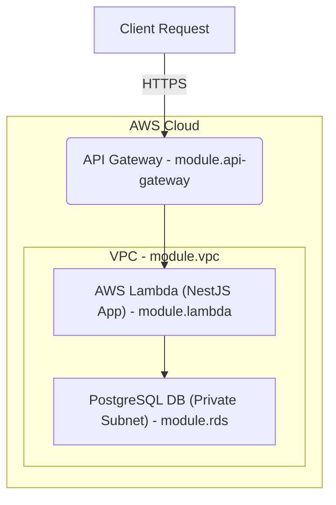
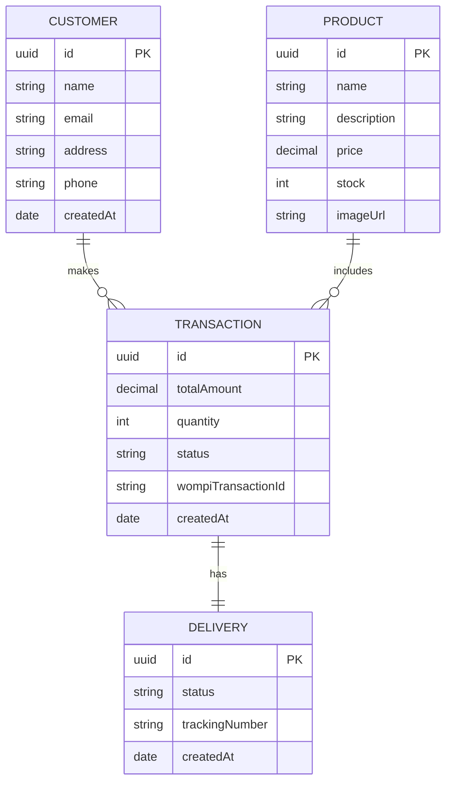

# Backend

## ⚙️ Infrastructure

This project follows a **serverless architecture** powered by **NestJS**, deployed to **AWS Lambda**, exposed via **API
Gateway**, and connected to a **PostgreSQL** database.

---

### 🧩 Components

- **AWS Lambda**: Runs the NestJS application as a single Lambda handler.
- **API Gateway**: Routes and manages all HTTP traffic to the Lambda function.
- **PostgreSQL**: Managed or local instance used for persistent storage.
- **S3 + DynamoDB**: Used to manage Terraform backend state with locking.
- **Terraform**: Manages all cloud infrastructure as code.

---

### 🗺️ Architecture Diagram (Mermaid)



### 🛠️ Setup Instructions

#### ✅ Prerequisites

Make sure you have the following tools installed:

- [Node.js](https://nodejs.org/en/download/) (v18+)
- [NestJS CLI](https://docs.nestjs.com/cli/overview) (v9+)
- [AWS CLI](https://docs.aws.amazon.com/cli/latest/userguide/getting-started-install.html) (v2+)
- [Terraform](https://www.terraform.io/downloads.html) (v1.5+)
- [Docker](https://docs.docker.com/get-docker/) (for local development and DB migrations)

---

#### 🧪 Makefile Commands

The `Makefile` provides commands to simplify the infrastructure workflow:

| Command           | Description                                   |
|-------------------|-----------------------------------------------|
| `make init`       | Initialize Terraform and install dependencies |
| `make plan`       | Generate Terraform execution plan             |
| `make apply`      | Deploy the infrastructure                     |
| `make destroy`    | Remove all Terraform-managed infrastructure   |
| `make validate`   | Validate Terraform configuration              |
| `make pkg`        | Package the NestJS app for Lambda deployment  |
| `make migrations` | Run database migrations using TypeORM         |

---

#### 🧾 Environment Variables

Create a `.env` file in the project root with the following variables:

```dotenv
PROJECT_NAME=your-project-name
S3_BUCKET_NAME=terraform-state-lock-bucket
AWS_REGION=your-aws-region
```

Create a `.env` file in the `src` folder with the following variables:

```dotenv
POSTGRES_HOST=localhost
POSTGRES_USERNAME=postgres
POSTGRES_PASSWORD=postgres
POSTGRES_NAME=postgres
POSTGRES_PORT=5430
```

> [!NOTE]
> The environment variables in the `src` folder are used only for local development.
> The variables used on AWS are set up through Terraform.

---

#### 📦 Install Dependencies

Run this command to install all required project dependencies:

```bash
npm install
```

---

#### 🧪 Run Locally

To run the app locally with hot-reload:

```bash
npm run start:local
```

The application will be available at `http://localhost:3000`.

## Backend

This backend is built with **NestJS** and follows a domain-driven and hexagonal architecture. It manages products,
customers, transactions, and deliveries, and integrates with the Wompi payment system.

---

## 📦 Modules Overview

### ✅ Products

- List all products
- Get product by ID

### 👤 Customers

- Embedded in transaction creation
- No standalone endpoint

### 💳 Transactions

- Create transaction (with customer data)
- Update transaction status
- Get transactions by customer email

### 🚚 Deliveries

- Automatically created through transaction creation
- Delivery status and tracking number managed internally

---

## 📁 Routes

| Method | Endpoint                   | Description                        |
|--------|----------------------------|------------------------------------|
| GET    | `/products`                | List all products                  |
| GET    | `/products/:id`            | Get a product by ID                |
| POST   | `/transactions`            | Create a transaction               |
| PATCH  | `/transactions/:id/status` | Update transaction status          |
| GET    | `/transactions/by-email`   | Get transactions by customer email |

---

## 📦 DTOs

### `CreateTransactionDto`

Includes:

- Product ID
- Customer data (name, email, address, phone)
- Total amount
- Quantity
- Initial status (default: `PENDING`)
- Optional: Wompi transaction ID

### `UpdateTransactionDto`

Includes:

- New status (`APPROVED` or `REJECTED`)
- Optional: Wompi transaction ID

### `GetTransactionsByEmailDto`

Includes:

- Customer email (validated)

---

## 🧠 Domain Models

Each database model has a corresponding domain entity.
Conversion is handled via static methods:

- `toDomain()` – maps from DB model to domain entity
- `fromDomain()` – maps from domain entity to DB model

---

## 🔗 Relationships

- A `Transaction` belongs to a `Product` and a `Customer`
- A `Delivery` is linked **1:1** with a `Transaction`

---

## 📊 Entity Diagram (Mermaid)

