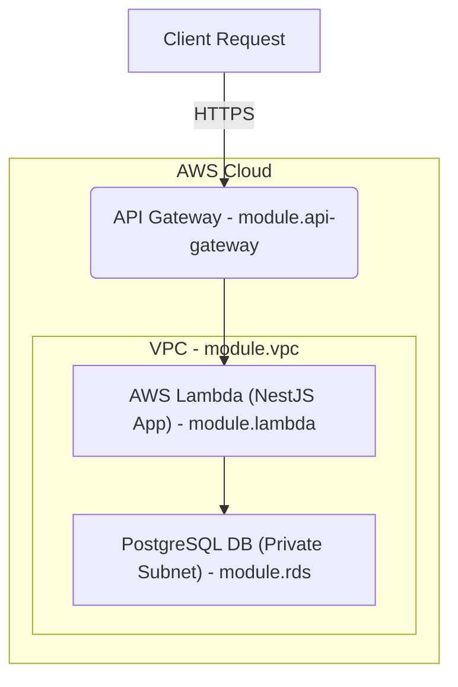

# Backend

## Infrastructure

This project follows a serverless architecture, using NestJS deployed to AWS Lambda, exposed via API Gateway, and connected to a PostgreSQL database.

### Components

- AWS Lambda: Runs the NestJS application as a single handler

- API Gateway: Proxies all HTTP traffic to Lambda

- PostgreSQL: Cloud-managed or local DB for persistent data

- S3 + DynamoDB: Used for state lock the terraform backend

- S3: Used to store media files

- Terraform: Used to provision and manage all infrastructures

### Architecture Diagram



## Setup

### Prerequisites
- [Node.js](https://nodejs.org/en/download/) (v18 or later)
- [NestJS CLI](https://docs.nestjs.com/cli/overview) (v9 or later)
- [AWS CLI](https://docs.aws.amazon.com/cli/latest/userguide/getting-started-install.html) (v2 or later)
- [Terraform](https://www.terraform.io/downloads.html) (v1.5 or later)
- [Docker](https://docs.docker.com/get-docker/) (for local development and migrations)

### Makefile
The Makefile is used to simplify the development process. It contains various commands for building, testing, and deploying the application.
- `make init`: Initializes the project by installing dependencies and setting up the terraform environment.
- `make plan`: Generates an execution plan for the terraform infrastructure.
- `make apply`: Applies the terraform plan to create or update the infrastructure.
- `make destroy`: Destroys the terraform-managed infrastructure.
- `make validate`: Validates the terraform configuration files.
- `make pkg`: Packages the NestJS application for deployment.

### Environment Variables
The application uses environment variables for configuration. Create a `.env` file in the root directory and add the following variables:

```dotenv
PROJECT_NAME=name-of-your-project
S3_BUCKET_NAME=name-of-the-s3-bucket-for-state-lock
AWS_REGION=name-of-the-region
```

### Installing Dependencies
To install the required dependencies, run the following command:

```bash
npm install
```

### Local Development
To run the application locally, use the following command:

```bash
npm run start:local
```
This will start the application on `http://localhost:3000`.
